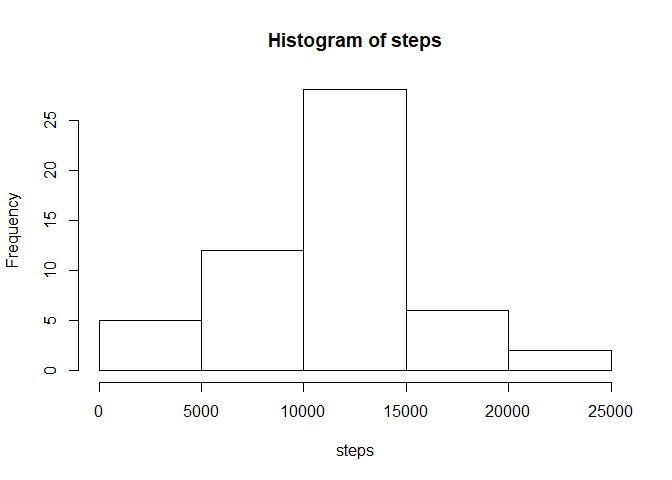
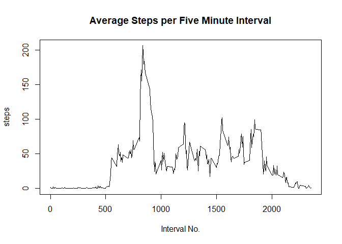

## Loading and preprocessing the data

First the data must be loaded into R and packages we will be using need to be initiated. We will assign it to the dataframe df.  


```r
library(ggplot2)
```

```
## Warning: package 'ggplot2' was built under R version 3.6.3
```

```r
library(dplyr)
```

```
## Warning: package 'dplyr' was built under R version 3.6.3
```

```
## 
## Attaching package: 'dplyr'
```

```
## The following objects are masked from 'package:stats':
## 
##     filter, lag
```

```
## The following objects are masked from 'package:base':
## 
##     intersect, setdiff, setequal, union
```

```r
fileUrl <- "https://github.com/rdpeng/RepData_PeerAssessment1/blob/master/activity.zip"
download.file(fileUrl, destfile = paste0(getwd(), '/activity.zip'), method = "curl")
unzip("activity.zip")
```

```
## Warning in unzip("activity.zip"): error 1 in extracting from zip file
```

```r
df <- read.csv('activity.csv', stringsAsFactors = F)
```

Next we need to make some changes to make the data work for our analysis.  
The Date variable is initially coded as a factor and needs to be changed to a date format (Year, Month, Day).


```r
df$date <- as.Date(df$date)
```


## What is mean total number of steps taken per day?

Let's now assess the data, specifically the Steps column of our dataset.  
First let us see the total number of steps taken per day.


```r
steps <- tapply(df$steps, df$date, sum)

print(steps)
```

```
## 2012-10-01 2012-10-02 2012-10-03 2012-10-04 2012-10-05 2012-10-06 2012-10-07 
##         NA        126      11352      12116      13294      15420      11015 
## 2012-10-08 2012-10-09 2012-10-10 2012-10-11 2012-10-12 2012-10-13 2012-10-14 
##         NA      12811       9900      10304      17382      12426      15098 
## 2012-10-15 2012-10-16 2012-10-17 2012-10-18 2012-10-19 2012-10-20 2012-10-21 
##      10139      15084      13452      10056      11829      10395       8821 
## 2012-10-22 2012-10-23 2012-10-24 2012-10-25 2012-10-26 2012-10-27 2012-10-28 
##      13460       8918       8355       2492       6778      10119      11458 
## 2012-10-29 2012-10-30 2012-10-31 2012-11-01 2012-11-02 2012-11-03 2012-11-04 
##       5018       9819      15414         NA      10600      10571         NA 
## 2012-11-05 2012-11-06 2012-11-07 2012-11-08 2012-11-09 2012-11-10 2012-11-11 
##      10439       8334      12883       3219         NA         NA      12608 
## 2012-11-12 2012-11-13 2012-11-14 2012-11-15 2012-11-16 2012-11-17 2012-11-18 
##      10765       7336         NA         41       5441      14339      15110 
## 2012-11-19 2012-11-20 2012-11-21 2012-11-22 2012-11-23 2012-11-24 2012-11-25 
##       8841       4472      12787      20427      21194      14478      11834 
## 2012-11-26 2012-11-27 2012-11-28 2012-11-29 2012-11-30 
##      11162      13646      10183       7047         NA
```

Now let's put that data in to a more readable format, a histogram.  


```r
hist(steps)
```

<!-- -->


Now we will calculate the mean and median for this step data. We will also ignore the non-reported values (NA).   


```r
mean(steps, na.rm = T)
```

```
## [1] 10766.19
```

```r
median(steps, na.rm = T)
```

```
## [1] 10765
```


## What is the average daily activity pattern?

The following will create a plot of the average number of steps taken per five minute interval.  


```r
stepsdata <- aggregate(steps ~ interval, data=df, mean, na.rm=TRUE)

plot(stepsdata$interval, stepsdata$steps, type="l", main="Average Steps per Five Minute Interval",
     xlab="Interval No.", ylab="steps")
```

<!-- -->


The following code will find at which interval is the max value of steps across then entire dataset.  


```r
df[which.max(df$steps),]
```

```
##       steps       date interval
## 16492   806 2012-11-27      615
```


## Imputing missing values

The dataset has missing data, as many datasets do. Let's now assess those missing pieces.  
First, let's find out how many missing values there are in the dataset.  


```r
sum(is.na(df))
```

```
## [1] 2304
```

To replace these missing values we have a few options, Mean/Median Imputation, kNN imputation, and Regression imputation.  
To keep things simple the following will impute the median value to all missing values in the dataset.  

First we need a new dataset that mirrors the original.  


```r
df2 <- df
```

We will need to create an object for the median for each day to impute.  


```r
stepmed <- tapply(df$steps, df$date, median)
```

Then we impute the median across all 'NA' or missing values. The last line is to double check no missing values exist in the new dataset.  


```r
df2$steps[is.na(df2$steps)] <- median(stepmed, na.rm = T)
sum(is.na(df2$steps))
```

```
## [1] 0
```

The median was chosen over the mean because it is more accurate. The mean was 37.38, but when assessing the data most of the days where this is activity hours of 5 min intervals are with no movment. Seemed wrong to give the variable steps a value between the hours of midnight and 7 am. Instead the median being 0 seemed more logical as an imputation of the data.  

Now let's see how this imputation affected our data. The first line of code creates a new daily sum of steps for the imputed data. Then the following code will create the same histogram from before looking at the total number of steps per day and a new histogram with the imputed data side by side.  


```r
steps2 <- tapply(df2$steps, df2$date, sum)

par(mfrow=c(1,2))
hist(steps)
hist(steps2)
```

<!-- -->

Looking at these graphs the original histogram looks to havea more normal distribution whereas the new imputed data skews a bit to the right. Also the counts of zeros is far higher as we imputed that as the median of the dataset for the missing values. This can bias our analysis assuming that the subject is far more lathargic than they actually might be.


## Are there differences in activity patterns between weekdays and weekends?

Let's see if the subject was more active on weekends or weekdays.  

First we will need to create a list of weekdays. For our purposes that will be Monday through Friday. Then we will need to create a new column for the part of the week each documented day is.  


```r
weekday <- c('Monday', 'Tuesday', 'Wednesday', 'Thursday', 'Friday')

df2$week_part <- factor((weekdays(df2$date) %in% weekday), levels = c(F,T), labels = c('weekend', 'weekday'))
```

Lastly we will create a graph to show the average steps taken per interval on both weekdays and weekends to track the difference in activity per part of the week.  


```r
ggplot(df2 , aes(x = interval , y = steps, color=week_part)) + 
        geom_line() + labs(title = "Avg. Daily Steps by Weektype", x = "Interval", y = "No. of Steps") + 
        facet_wrap(~week_part , ncol = 1, nrow=2)
```

<!-- -->

As can be seen, on average there is more activity over the course of a day during the week than the weekend.The weekend has a skewed left distribution whereas the weekday looks more 'normal' if not slightly skewed left. The weekday graph consisitently has higher number of steps over the course of the day than the weekend graph. This may be due to the fact that our weekend variable only covers two days whereas the weekday variable covers five. Future analysis on this may divide the week up into different, more even sections to account for this bias. 
